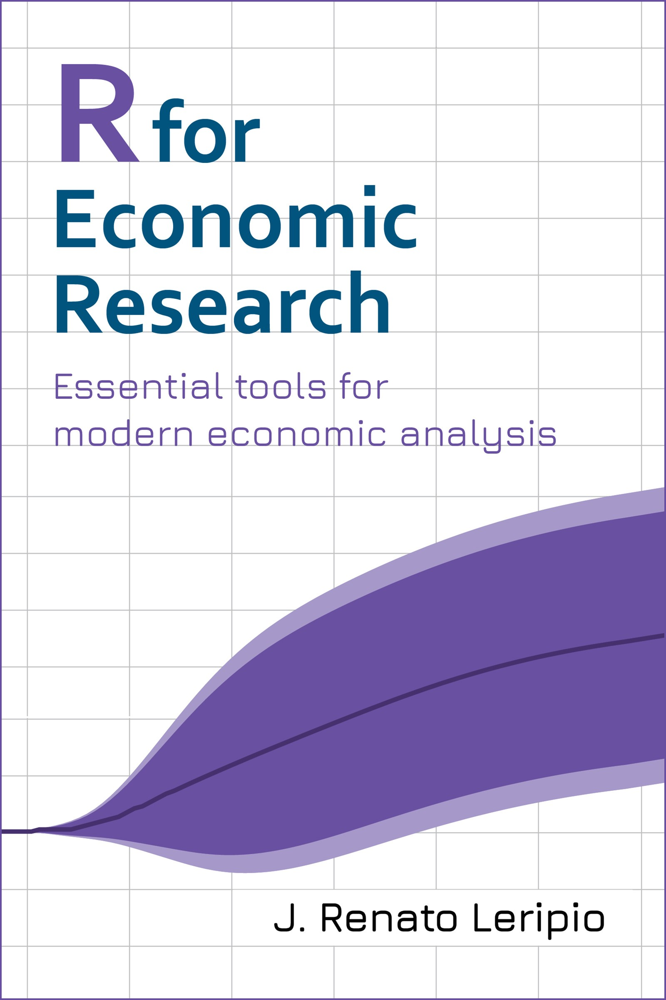

# Preface

Over the past years I've received a lot of messages asking what I considered to be the most important subjects one should learn in order to start a career in economic research. R for Economic Research is my contribution to those who have some knowledge of R programming but still lack the necessary tools to carry out professional economic analysis. This is an intermediate-level book where the reader will find shortcuts to start working on a variety of tasks and also valuable references to delve into the details of more complex topics.

After six years as a professional in this field, I believe I am in a position to suggest a set of necessary tools for this type of work. The reasoning behind the book can be described as follows.

**Modern economic research requires a solid knowledge of a programming language**. In fact, with a growing set of data now available through APIs it is possible to produce automated analyzes almost instantly using efficient techniques. In addition, unstructured data only becomes true information if correctly handled. I chose R because I strongly believe that Tidyverse is unrivaled as a data science workflow.

**It does require more than just programming**. Indeed, I have interviewed several applicants who were quite proficient in programming but lacked knowledge of basic topics on applied time series. For example, they didn't know how to perform seasonal adjustment nor how to deflating nominal to real values. Filling in these gaps is crucial.

**Knowledge about forecasting is vital**. I'm definitely not talking about state-of-the-art machine learning models. In fact, most problems can be addressed with traditional statistical methods. Setting up the workflow to generate reliable forecasts is the relevant skill here.

**I can't help but talk about economic modelling**. Estimating the relationship between economic variables and making projections is the core business of those who work with economic research. Despite being a topic that requires theoretical and applied training beyond the scope of this book, I believe that showing how to set up the framework for these models is a valuable contribution for those who want to start in the field.

**Taking it to the next level**. Some tools allow us to considerably expand our possibilities. Learning how to build and estimate state-space models is undoubtedly a big step forward in becoming a senior analyst.

I really hope that you enjoy reading this book and that it can benefit you in your career.

Also, I would be very happy to receive suggestions and feedback via [email](mailto:leripiorenato@gmail.com).

<a property="dct:title" rel="cc:attributionURL" href="http://book.rleripio.com">R for Economic Research: Essential tools for modern economic analysis</a> by <a rel="cc:attributionURL dct:creator" property="cc:attributionName" href="http://www.rleripio.com">J. Renato Leripio</a> is licensed under <a href="http://creativecommons.org/licenses/by-nc-sa/4.0/?ref=chooser-v1" target="_blank" rel="license noopener noreferrer" style="display:inline-block;">Attribution-NonCommercial-ShareAlike 4.0 International</a>

